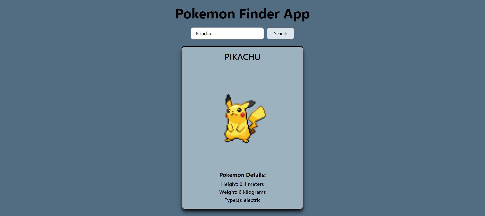

# Pokemon Finder App




The Pokemon Finder App is a web application that allows users to search for detailed information about Pokemon by entering their names. This app is built using Vite, React, and Tailwind CSS, making it a fast, modern, and visually appealing way to explore the world of Pokemon.

## Features

- Pokemon Search: Enter the name of a Pokemon in the search bar and click the "Search" button to retrieve information about that Pokemon.

- Detailed Information: View the Pokemon's name, image, height, weight, and types.

- Error Handling: If an invalid Pokemon name is entered, the app will display an appropriate error message.

## Installation

To run the Pokemon Finder App locally on your machine, follow these steps:

Clone the repository:

```bash
git clone https://github.com/nurdinbeta/pokemon-app.git
cd pokemon-app
```

Install dependencies:

```bash
npm install
```

Start the development server:

```bash
npm run dev
```

Open your web browser and navigate to http://localhost:5173/ to access the app.

## Usage

- On the main page, you'll find a search bar.

- Enter the name of a Pokemon you want to search for.

- Click the "Search" button.

- If the Pokemon is found, you'll see its name, image, height, weight, and types displayed on the screen.

- If an invalid Pokemon name is entered, the app will show an error message indicating that the Pokemon was not found.

## Contributing

If you'd like to contribute to the development of this app, please follow these guidelines:

1. Fork the repository.
2. Create a new branch for your feature or bug fix: git checkout -b feature-name
3. Make your changes and commit them with a clear and concise commit message.
4. Push your changes to your fork: git push origin feature-name
5. Create a pull request to the main repository.
6. Be open to feedback and collaborate with others to improve the app.
